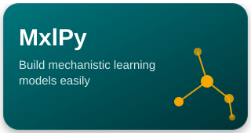
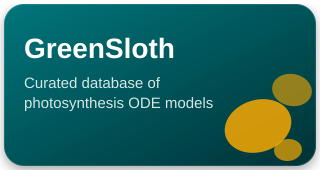

[mxlpy-repo]: https://github.com/Computational-Biology-Aachen/MxlPy
[mxlpy-stars]: https://img.shields.io/github/stars/Computational-Biology-Aachen/MxlPy?style=flat-square&logo=github&label=stars
[mxlpy-updated]: https://img.shields.io/github/last-commit/Computational-Biology-Aachen/MxlPy?style=flat-square&label=updated

[mxlbricks-repo]: https://github.com/Computational-Biology-Aachen/mxl-bricks
[mxlbricks-stars]: https://img.shields.io/github/stars/Computational-Biology-Aachen/mxl-bricks?style=flat-square&logo=github&label=stars
[mxlbricks-updated]: https://img.shields.io/github/last-commit/Computational-Biology-Aachen/mxl-bricks?style=flat-square&label=updated

[mxlmodels-repo]: https://github.com/Computational-Biology-Aachen/mxl-models
[mxlmodels-stars]: https://img.shields.io/github/stars/Computational-Biology-Aachen/mxl-models?style=flat-square&logo=github&label=stars
[mxlmodels-updated]: https://img.shields.io/github/last-commit/Computational-Biology-Aachen/mxl-models?style=flat-square&label=updated

[pysbml-repo]: https://github.com/Computational-Biology-Aachen/pysbml
[pysbml-stars]: https://img.shields.io/github/stars/Computational-Biology-Aachen/pysbml?style=flat-square&logo=github&label=stars
[pysbml-updated]: https://img.shields.io/github/last-commit/Computational-Biology-Aachen/pysbml?style=flat-square&label=updated

[parameteriser-repo]: https://github.com/Computational-Biology-Aachen/parameteriser
[parameteriser-stars]: https://img.shields.io/github/stars/Computational-Biology-Aachen/parameteriser?style=flat-square&logo=github&label=stars
[parameteriser-updated]: https://img.shields.io/github/last-commit/Computational-Biology-Aachen/parameteriser?style=flat-square&label=updated

[absorpig-repo]: https://github.com/Computational-Biology-Aachen/absorpig
[absorpig-stars]: https://img.shields.io/github/stars/Computational-Biology-Aachen/absorpig?style=flat-square&logo=github&label=stars
[absorpig-updated]: https://img.shields.io/github/last-commit/Computational-Biology-Aachen/absorpig?style=flat-square&label=updated

[mxlmcp-repo]: https://github.com/Computational-Biology-Aachen/mxl-mcp
[mxlmcp-stars]: https://img.shields.io/github/stars/Computational-Biology-Aachen/mxl-mcp?style=flat-square&logo=github&label=stars
[mxlmcp-updated]: https://img.shields.io/github/last-commit/Computational-Biology-Aachen/mxl-mcp?style=flat-square&label=updated

[mxlweb-repo]: https://github.com/Computational-Biology-Aachen/mxl-web
[mxlweb-stars]: https://img.shields.io/github/stars/Computational-Biology-Aachen/mxl-web?style=flat-square&logo=github&label=stars
[mxlweb-updated]: https://img.shields.io/github/last-commit/Computational-Biology-Aachen/mxl-web?style=flat-square&label=updated

[greensloth-repo]: https://github.com/Computational-Biology-Aachen/green-sloth
[greensloth-stars]: https://img.shields.io/github/stars/Computational-Biology-Aachen/green-sloth?style=flat-square&logo=github&label=stars
[greensloth-updated]: https://img.shields.io/github/last-commit/Computational-Biology-Aachen/green-sloth?style=flat-square&label=updated

[comphot-repo]: https://github.com/Computational-Biology-Aachen/comphot
[comphot-stars]: https://img.shields.io/github/stars/Computational-Biology-Aachen/comphot?style=flat-square&logo=github&label=stars
[comphot-updated]: https://img.shields.io/github/last-commit/Computational-Biology-Aachen/comphot?style=flat-square&label=updated

[design-repo]: https://github.com/Computational-Biology-Aachen/design
[design-stars]: https://img.shields.io/github/stars/Computational-Biology-Aachen/design?style=flat-square&logo=github&label=stars
[design-updated]: https://img.shields.io/github/last-commit/Computational-Biology-Aachen/design?style=flat-square&label=updated

[cpblio-repo]: https://github.com/Computational-Biology-Aachen/Computational-Biology-Aachen.github.io
[cpblio-stars]: https://img.shields.io/github/stars/Computational-Biology-Aachen/Computational-Biology-Aachen.github.io?style=flat-square&logo=github&label=stars
[cpblio-updated]: https://img.shields.io/github/last-commit/Computational-Biology-Aachen/Computational-Biology-Aachen.github.io?style=flat-square&label=updated

[synechocystis-repo]: https://github.com/Computational-Biology-Aachen/synechocystis-photosynthesis-2024
[fightclub-repo]: https://github.com/Computational-Biology-Aachen/FightClub
[hackathon2026-repo]: https://github.com/Computational-Biology-Aachen/2026-photosynthesis-hackathon
[studentunion-repo]: https://github.com/Computational-Biology-Aachen/StudentUnion

    

# The Matuszyńska Lab (CPBL)

### Reimagining photosynthesis for sustainable agriculture — one model at a time.

We are the Computational and Plant Biology Lab at RWTH Aachen University, building mechanistic and mechanistic-learning models of photosynthesis and metabolism. Our work rests on three pillars: **research** (integrative models that predict plant performance under real-world stress), **education** (coding and systems-biology training), and **citizen science** (connecting plant modeling to climate solutions).

This organisation hosts the software, models, and course material that come out of the lab — most of it built around our `mxl` ecosystem for mechanistic learning.

  
  &nbsp;&nbsp;&nbsp;&nbsp;
  
  &nbsp;&nbsp;&nbsp;&nbsp;
  

[🔗 cpbl.rwth-aachen.de](https://www.cpbl.rwth-aachen.de/) · [🌐 Lab website](https://computational-biology-aachen.github.io/) · 📍 Worringerweg 1, 52074 Aachen

---

## Core software

| Project                                                                                                    | Description                                                                  |
| ---------------------------------------------------------------------------------------------------------- | ---------------------------------------------------------------------------- |
| **[MxlPy][mxlpy-repo]** ![Stars][mxlpy-stars] ![Updated][mxlpy-updated]                                 | Our flagship package — build mechanistic learning models easily              |
| **[MxlBricks][mxlbricks-repo]** ![Stars][mxlbricks-stars] ![Updated][mxlbricks-updated]                 | Combine reaction bricks to quickly build larger models                       |
| **[MxlModels][mxlmodels-repo]** ![Stars][mxlmodels-stars] ![Updated][mxlmodels-updated]                 | Python package of reference mechanistic models                               |
| **[PySBML][pysbml-repo]** ![Stars][pysbml-stars] ![Updated][pysbml-updated]                             | Makes SBML models simpler                                                    |
| **[Parameteriser][parameteriser-repo]** ![Stars][parameteriser-stars] ![Updated][parameteriser-updated] | Interface parameter databases like BRENDA for kinetic model parameterisation |
| **[absorpig][absorpig-repo]** ![Stars][absorpig-stars] ![Updated][absorpig-updated]                     | Extract **pig**ment composition from measured **absor**ption spectra         |
| **[mxl-mcp][mxlmcp-repo]** ![Stars][mxlmcp-stars] ![Updated][mxlmcp-updated]                            | MCP server exposing the mxl packages to LLM agents                           |

## Interactive tools & websites

| Project                                                                                                        | Description                                                                          |
| -------------------------------------------------------------------------------------------------------------- | ------------------------------------------------------------------------------------ |
| **[mxl-web][mxlweb-repo]** ![Stars][mxlweb-stars] ![Updated][mxlweb-updated]                                | Experimental toolbox to run ODE models directly in the browser                       |
| **[GreenSloth][greensloth-repo]** ![Stars][greensloth-stars] ![Updated][greensloth-updated]                 | Community-curated database & interactive explorer of photosynthesis ODE models       |
| **[comphot][comphot-repo]** ![Stars][comphot-stars] ![Updated][comphot-updated]                             | Educational site teaching computational photosynthesis                               |
| **[design][design-repo]** ![Stars][design-stars] ![Updated][design-updated]                                 | Shared CPBL design system (RWTH tokens + Svelte 5 components) all our sites build on |
| **[Computational-Biology-Aachen.github.io][cpblio-repo]** ![Stars][cpblio-stars] ![Updated][cpblio-updated] | Source of our main lab website                                                       |

## Research & outreach

| Project                                                     | Description                                                                               |
| ----------------------------------------------------------- | ----------------------------------------------------------------------------------------- |
| **[synechocystis-photosynthesis-2024][synechocystis-repo]** | A mathematical model of photosynthetic electron transport in *Synechocystis* sp. PCC 6803 |
| **[FightClub][fightclub-repo]**                             | Modelling tripartite microbial dynamics: competitive & cooperative nutrient strategies    |
| **[2026-photosynthesis-hackathon][hackathon2026-repo]**     | Our annual photosynthesis modeling hackathon                                              |
| **[StudentUnion][studentunion-repo]**                       | Shared code base for students of the Computational Life Science group                     |

<!-- | **[contributor-map](https://github.com/Computational-Biology-Aachen/contributor-map)**                                                                           | A map of the countries our contributors (or their families) call home ❤️                   | -->
<!-- | **[2025-mxlpy-publication](https://github.com/Computational-Biology-Aachen/2025-mxlpy-publication)**                                               | Notebooks reproducing the figures of the 2025 MxlPy publication                           | -->
<!-- | **[ChillSugar](https://github.com/Computational-Biology-Aachen/ChillSugar)**                                                                                               | Chilling nights & sugar metabolism                                                        | -->
---

## Get involved

We run open hackathons (including in Kenya — see [`2022-hackathon-watamu`](https://github.com/Computational-Biology-Aachen/2022-hackathon-watamu) and [`2023-hackathon-embu`](https://github.com/Computational-Biology-Aachen/2023-hackathon-embu)) and welcome contributions from students and researchers worldwide. Most of our packages are MIT-licensed and take issues/PRs — check each repo's `CONTRIBUTING` for details.
